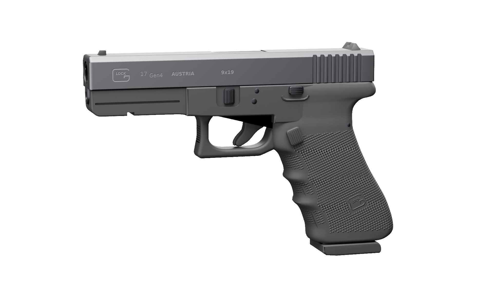
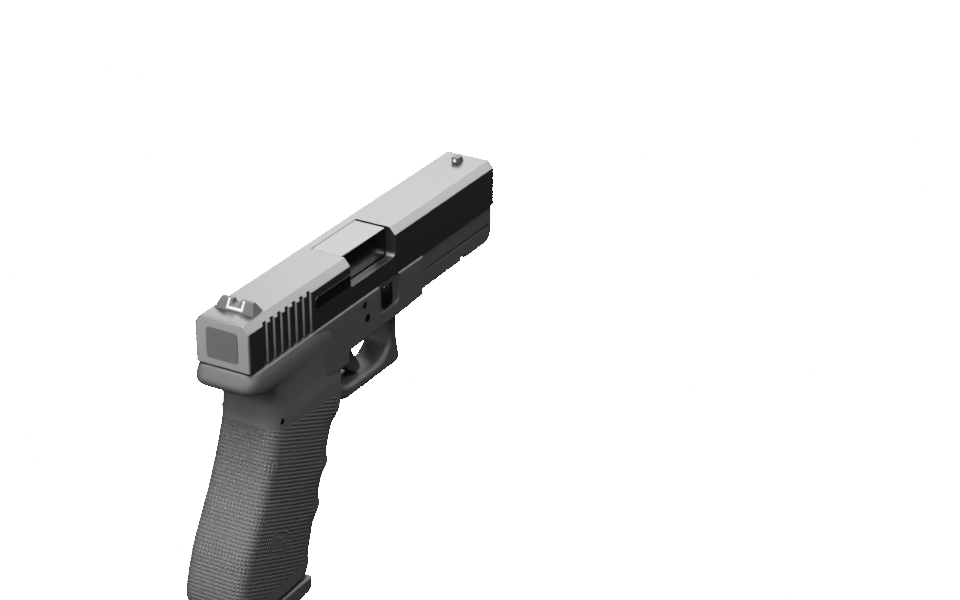
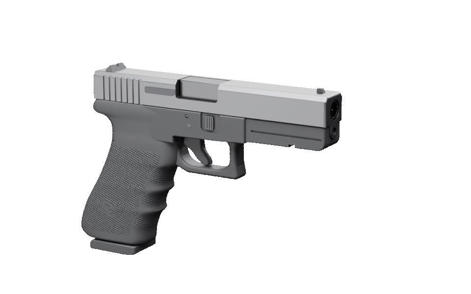
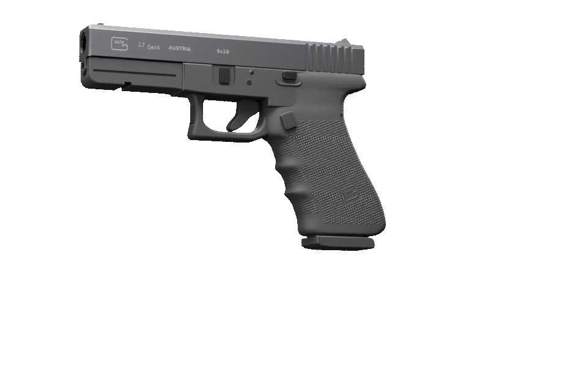
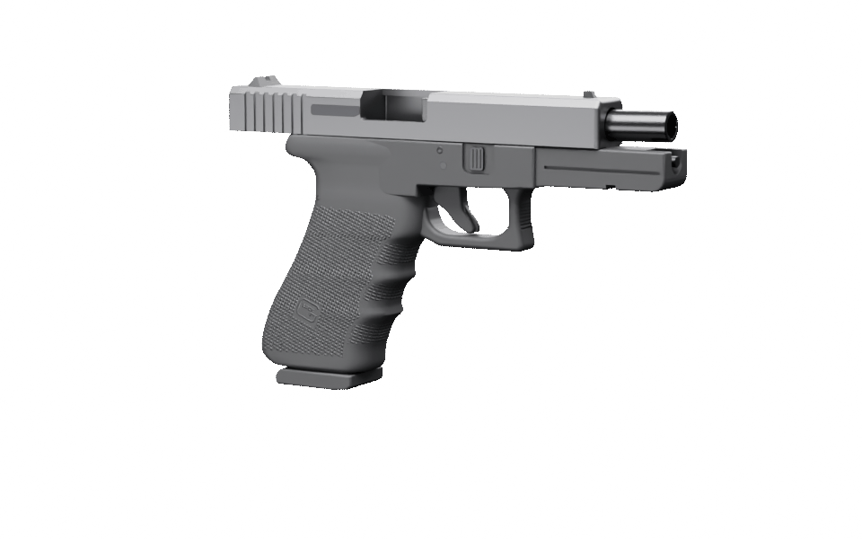

# Glock 17 Gen4 – model 3D (Blender) z animacjami i wersją do FiveM



Model 3D pistoletu **Glock 17 Gen4** wykonany w Blenderze 4.5 (render: Cycles),
z animacjami strzału, wyrzutu łuski i przeładowania. W folderze
[`fivem/glock17`](fivem/glock17) jest gotowy zasób broni do serwera FiveM
(GTA V). Proporcje odwzorowano według oficjalnej karty wymiarów GLOCK
i zdjęcia produktowego.

| Strzał – wyrzut łuski (spowolnione 4×) | Ostatni strzał – zamek zostaje w tylnym położeniu (2×) |
|---|---|
|  |  |
| **Przeładowanie** | **Przeładowanie z pustego magazynka** |
|  |  |

Wszystkie widoki na jednym arkuszu: [`renders/preview_sheet.png`](renders/preview_sheet.png).
Animacje w lepszej jakości są w plikach `renders/anim_*.mp4`.

## Parametry

| | |
|---|---|
| Trójkąty | **20 456** (limit 30 000), w tym łuska, nabój w magazynku i płomień wylotowy |
| Poligony w pliku `.blend` | 10 085 (quady i n-gony) |
| Wymiary modelu | 201,4 × 30,4 × 138,0 mm |
| Wymiary wg specyfikacji GLOCK | długość 202 mm, zamek 186 × 25,5 mm, wysokość z magazynkiem 139 mm |
| Jednostki | metry, skala 1:1 |
| Orientacja | jak broń w GTA V: lufa w kierunku +X, góra +Z, lewa strona pistoletu po stronie +Y; początek układu w punkcie odniesienia standardowego pistoletu GTA (nad spustem) |
| Animacje | 30 kl./s: `fire`, `fire_empty`, `reload`, `reload_empty` |

Szerokość modelu (30,4 mm) odpowiada chwytowi zmierzonemu na rzucie z tyłu
na karcie wymiarów. Wartość 32 mm ze specyfikacji to szerokość całkowita.

## Pliki

| Plik | Zawartość |
|---|---|
| `glock17_gen4.blend` | scena z modelem, szkieletem, animacjami, materiałami, spakowanymi teksturami, kamerą i oświetleniem (F12 renderuje podgląd) |
| `glock17_gen4.glb` | glTF 2.0: model, szkielet, 4 animacje, tekstury (Unity, Unreal, Godot, three.js, przeglądarki) |
| `glock17_gen4.fbx` | FBX: model, szkielet, 4 animacje, osadzone tekstury; siatka striangulowana, zapisane styczne |
| `glock17_gen4_lowpoly.blend/.glb/.fbx` | wersja niskopoligonowa (5 386 trójkątów z łuską i płomieniem), te same kości i animacje |
| `fivem/glock17_lowpoly/` | zasób FiveM z wersją niskopoligonową: 4 704 trójkąty broni + 440 magazynka |
| `fivem/glock17/` | zasób FiveM: broń `WEAPON_GLOCK17` w formatach GTA V (`.ydr`, `.ytd`, `.ycd`) i pliki meta. Instrukcja: [`fivem/glock17/README.md`](fivem/glock17/README.md) |
| `preview.png` | główny obraz podglądowy (1920 × 1200) |
| `renders/` | widoki, zbliżenia detali, render siatki, arkusz zbiorczy, animacje (`anim_*.gif`, `anim_*.mp4`) |
| `textures/` | mapa normalnych chwytu (z logo i bez), grawery zamka (normal, kolor, szorstkość) |
| `scripts/` | skrypty, które odtwarzają wszystko od zera |
| `tools/cwxml2bin/` | konwerter plików XML CodeWalkera na binarne zasoby GTA V (.NET 8) |

## Struktura modelu

Części są osobnymi siatkami, a każda jest w całości przypięta (skinning)
do jednej kości szkieletu `Glock17_Gen4`. Szkielet ma kości i położenia
spoczynkowe standardowego pistoletu GTA V, uzupełnione o kości części,
które porusza tylko ten model.

| Obiekt | Trójkąty | Kość | Zawartość |
|---|---:|---|---|
| `Slide` | 3 514 | `Gun_Cock1` | zamek z fazowaną górą, 7 tylnych nacięć Gen4, okno wyrzutnika z wnęką (przy odsuniętym zamku widać komorę i magazynek), wyciąg, muszka z białą kropką, szczerbinka z białym obrysem „U”, tylna pokrywa, grawery GLOCK / 17 Gen4 / AUSTRIA / 9x19 |
| `Barrel` | 746 | `Gun_Barrel` | lufa z sześciokątnym (poligonalnym) przewodem i komorą nabojową |
| `RecoilSpringGuide` | 158 | `Gun_Main_Bone` | prowadnica sprężyny powrotnej (widoczna przy odsuniętym zamku) |
| `Frame` | 10 564 | `Gun_Main_Bone` | rama polimerowa: osłona z szyną montażową, osłona spustu z karbowaniem, chwyt Gen4 z wgłębieniami na palce i teksturą RTF, „bobrzy ogon”, gniazdo magazynka z rozszerzonym wlotem, zatrzask rozkładania po obu stronach, kołki, osłona zatrzasku zamka, tabliczka numeru seryjnego |
| `Trigger` | 460 | `Gun_Trigger_Pr` | spust |
| `TriggerSafety` | 212 | `Gun_TriggerSafety` | bezpiecznik spustu (Safe Action) |
| `SlideStop` | 1 260 | `Gun_SlideStop` | zatrzask zamka z karbowaniem |
| `MagazineCatch` | 1 788 | `Gun_MagRelease` | powiększony, żebrowany zaczep magazynka Gen4 |
| `Magazine` | 696 | `WAPClip` | magazynek na 17 naboi (korpus na całej długości, stopka) |
| `MagazineRound` | 608 | `Gun_MagRound` | górny nabój 9×19 w magazynku (łuska mosiężna, pocisk FMJ) |
| `Casing` | 416 | `Gun_Shell` | łuska 9×19 w komorze, wyrzucana przy strzale |
| `MuzzleFlash` | 34 | `Gun_Flash` | płomień wylotowy; w spoczynku zwinięty w lufie, klip `fire` go skaluje |

Pozostałe kości to punkty odniesienia dla gry: `Gun_Muzzle` (wylot lufy),
`Gun_VFX_Eject` (okno wyrzutnika), `WAPFlshLasr` (latarka pod szyną),
`WAPSupp` (tłumik) oraz `Gun_Root`, `Gun_GripR` (chwyt dłoni),
`Gun_Main_Bone`, `Gun_Hammer`, `Gun_Safety`.

## Animacje

| Klip | Czas | Przebieg |
|---|---|---|
| `fire` | 0,70 s (21 klatek) | naciśnięcie bezpiecznika i spustu, płomień, cofnięcie zamka o 34 mm, odryglowanie lufy (cofnięcie o 3 mm i opuszczenie tylnej części), wyciągnięcie i **wyrzut łuski** w prawo i do góry z obrotem, powrót zamka z podaniem naboju z magazynka do komory, reset spustu |
| `fire_empty` | 0,70 s (21 klatek) | jak `fire`, ale magazynek jest pusty: zatrzask zamka unosi się i zatrzymuje zamek w tylnym położeniu |
| `reload` | 1,73 s (52 klatki) | wciśnięcie zaczepu, wypadnięcie magazynka, włożenie nowego magazynka i jego zatrzaśnięcie |
| `reload_empty` | 2,13 s (64 klatki) | przeładowanie przy zamku w tylnym położeniu, potem zwolnienie zatrzasku zamka: zamek wraca i dosyła nabój |

Klipy są zapisane w pliku `.blend` jako akcje (Action Editor / ścieżki NLA
obiektu `Glock17_Gen4`), a w plikach `.glb` i `.fbx` jako animacje szkieletu.
Każdy klip ustawia wszystkie ruchome części, więc można je przełączać
w dowolnej kolejności.

## FiveM / GTA V

Folder [`fivem/glock17`](fivem/glock17) to samodzielny zasób (standalone):
wystarczy go skopiować do `resources` i dopisać `ensure glock17` w
`server.cfg`. Broń nazywa się `WEAPON_GLOCK17`, a magazynek (17 naboi) to
komponent `COMPONENT_GLOCK17_CLIP_01`. W grze broń używa animacji
standardowego pistoletu. Poruszają one zamkiem i spustem tego modelu,
bo szkielet ma te same kości. Łuska wylatuje z okna wyrzutnika (efekt
`eject_pistol`), a płomień pojawia się na wylocie lufy. Szczegóły, przykłady
dla ox_inventory i qb-core oraz wersja tekstur bez oznaczeń GLOCK są
w [`fivem/glock17/README.md`](fivem/glock17/README.md).

Plik binarny sprawdzono konwersją z powrotem do XML w CodeWalkerze. Szkielet
(tagi, rodzice, flagi), shader `normal_spec`, układ wierzchołków i komponent
magazynka są zgodne z działającą bronią add-on. Samej broni nie testowano
na serwerze FiveM.

## Materiały i tekstury

- **Zamek, lufa, części stalowe**: ciemny, satynowy metal (PBR, metallic).
- **Rama**: matowy czarny polimer. W Blenderze dochodzi do tego drobna
  proceduralna struktura; do glTF i FBX trafiają same wartości PBR.
- **Tekstura RTF chwytu** (`textures/grip_normal.png`, 0,1 mm/px): kwadratowe
  wypustki ułożone wzdłuż osi chwytu, żeberka we wgłębieniach na palce
  i wytłoczone logo GLOCK po obu stronach. Mapowanie UV chwytu: U to długość
  łuku przekroju mierzona od środka przedniej ścianki, V to wysokość.
- **Grawery zamka** (`textures/slide_markings_*.png`, 0,05 mm/px): rzut
  płaski lewej strony zamka.
- **Łuska i nabój**: mosiądz i tombak (pocisk pełnopłaszczowy), wymiary
  naboju 9×19 mm wg C.I.P.
- **Wersja GTA V**: shader `normal_spec`, tekstury DXT5 z mipmapami, mapy
  normalnych w konwencji DirectX. Czarny kolor, a każdy materiał ma powtarzalną
  teksturę (chropowaty polimer, ziarno nitrydowanego metalu); tekstury koloru
  są nieskompresowane, żeby czerń nie dostała odcienia. Magazynek ma bryłę
  kolizji, więc po wyjęciu spada na ziemię.

## Jak odtworzyć model

Wymagany jest Python 3.11 i moduł Blendera z PyPI:

```bash
pip install "bpy==4.5.*" numpy pillow
python scripts/make_textures.py            # tekstury -> textures/
python scripts/build_glock17.py            # model, szkielet, animacje, .blend/.glb/.fbx, rendery
python scripts/render_anims.py             # animacje -> renders/anim_*.gif, anim_*.mp4
python scripts/make_sheet.py               # preview.png i renders/preview_sheet.png
```

Wersja niskopoligonowa: `python scripts/build_glock17.py --low` oraz
`python scripts/export_fivem.py --low ...` (mniej segmentów na zaokrągleniach,
rzadszy chwyt, uproszczone obrysy; detale zostają w teksturach).

Opcje `build_glock17.py`: `--no-render` (tylko model i eksport), `--quick`
(szybkie podglądy w niskiej rozdzielczości), `--views=hero,left,...`.
Skrypty działają też w samym Blenderze 4.2+: `blender -b -P scripts/build_glock17.py`.

Zasób FiveM:

```bash
# jednorazowo: konwerter XML -> binarne pliki GTA V (.NET 8 SDK + CodeWalker)
git clone https://github.com/dexyfex/CodeWalker ../dexyfex/codewalker
dotnet build -c Release tools/cwxml2bin
# eksport (Sollumz 2.8.x z zależnością szio, np. zainstalowany w Blenderze)
python scripts/export_fivem.py --sollumz=/ścieżka/do/folderu/z/sollumz
```

- `scripts/glock_data.py`: wymiary i profile w mm zmierzone z karty wymiarów
  (skala 0,354 mm/px), geometria przekrojów chwytu, wymiary naboju,
  szkielet GTA V.
- `scripts/build_glock17.py`: budowa części, materiały, szkielet, scena,
  rendery, eksport.
- `scripts/glock_anim.py`: klipy animacji (ruchy opisane funkcjami czasu).
- `scripts/render_anims.py`: rendery animacji (GIF i MP4).
- `scripts/export_fivem.py`, `scripts/fivem_meta.py`: zasób FiveM.
- `scripts/make_textures.py`: tekstury (numpy + Pillow).
- `scripts/make_sheet.py`: obrazy podglądowe.

## Źródła

- Oficjalna karta wymiarów GLOCK 17 Gen4: długość 202 mm, zamek 186 mm,
  szerokość zamka 25,5 mm, wysokość z magazynkiem 139 mm, linia celownicza
  165 mm. Rzut boczny posłużył do zmierzenia profili zamka, ramy, osłony
  spustu, spustu, chwytu i stopki magazynka.
- Zdjęcie produktowe: rozmieszczenie i wygląd detali (nacięcia, oznaczenia,
  tekstura, zatrzaski).
- Szkielet, pliki meta i struktura zasobu: standardowy pistolet GTA V
  w postaci, w jakiej używają go dodatki broni do FiveM (np.
  [NoobySloth/Custom-Weapons](https://github.com/NoobySloth/Custom-Weapons)).
