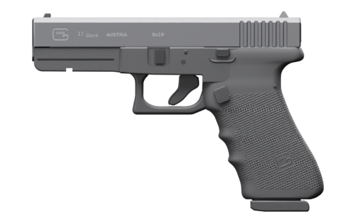

# Glock 17 Gen4 – broń add-on do FiveM (standalone)

Zasób dodaje broń **`WEAPON_GLOCK17`**: model, tekstury, magazynek, animacje
i pliki meta. Nie wymaga żadnego frameworka (ESX, QBCore, ox itp.).



## Instalacja

1. Skopiuj folder `glock17` do katalogu `resources` serwera.
2. Dopisz do `server.cfg`:
   ```
   ensure glock17
   ```
3. Przekaż broń graczowi ze skryptu po stronie serwera albo z konsoli txAdmin:
   ```lua
   GiveWeaponToPed(GetPlayerPed(playerId), `WEAPON_GLOCK17`, 85, false, true)
   ```
   Do testów możesz ustawić `Config.TestCommand = true` w `config.lua` i wpisać
   w grze `/glock17`. Komenda działa dla każdego gracza, dlatego na
   publicznym serwerze zostaw `false`.

## Zawartość

| Plik | Opis |
|---|---|
| `stream/w_pi_glock17.ydr`, `w_pi_glock17_hi.ydr` | model broni ze szkieletem pistoletu GTA V |
| `stream/w_pi_glock17.ytd`, `w_pi_glock17+hi.ytd` | tekstury (grawery zamka, tekstura RTF chwytu) |
| `stream/w_pi_glock17_mag1.ydr`, `.ytd` | magazynek, komponent `COMPONENT_GLOCK17_CLIP_01` (17 naboi) |
| `stream/anim@w_pi_glock17.ycd` | własne klipy modelu: `fire`, `fire_empty`, `reload`, `reload_empty` |
| `meta/*.meta` | `weapons`, `weaponcomponents`, `weaponarchetypes`, `weaponanimations`, `pedpersonality` |
| `config.lua`, `client.lua` | nazwa broni w grze, komenda testowa, opcjonalne klipy modelu |
| `images/weapon_glock17.png` | ikona do ekwipunku (512 × 320, przezroczyste tło) |
| `optional/bez_oznaczen/` | tekstury bez oznaczeń GLOCK (opis niżej) |

## Animacje w grze

Szkielet modelu ma te same kości i położenia spoczynkowe co standardowy
pistolet GTA V (`Gun_Root`, `Gun_GripR`, `Gun_Main_Bone`, `Gun_Cock1`,
`Gun_Trigger_Pr`, `WAPClip`, …). Dzięki temu model korzysta z animacji gry:

- **Strzał**: animacja pistoletu cofa zamek (`Gun_Cock1`) i ściąga spust
  (`Gun_Trigger_Pr`), razem z bezpiecznikiem na spuście.
- **Wyrzut łuski**: efekt `eject_pistol` startuje z kości `Gun_VFX_Eject`,
  ustawionej w oknie wyrzutnika. Płomień `muz_pistol` pojawia się przy
  kości `Gun_Muzzle` na wylocie lufy.
- **Przeładowanie**: animacje postaci z gry. Magazynek jest osobnym obiektem
  (komponentem) przypiętym do `WAPClip`, więc postać go wyjmuje i wkłada.
- **Latarka**: pod szyną jest punkt `WAPFlshLasr`, pasuje standardowa latarka:
  ```lua
  GiveWeaponComponentToPed(ped, `WEAPON_GLOCK17`, `COMPONENT_AT_PI_FLSH`)
  ```
- `Config.ModelClips = true` włącza klipy samego modelu (`anim@w_pi_glock17`).
  Dodatkowo poruszają one lufą, zatrzaskiem zamka i zaczepem magazynka.
  Opcja jest **eksperymentalna**: klipy są poprawne technicznie (plik
  sprawdzony w CodeWalker), ale nie zostały przetestowane w grze.

Parametry broni (obrażenia, odrzut, szybkostrzelność, dźwięk) są takie jak
w standardowym pistolecie gry. Można je zmienić w `meta/weapons.meta`.

## Integracje

**ox_inventory**: w `data/weapons.lua`, w sekcji `Weapons`:

```lua
['WEAPON_GLOCK17'] = {
    label = 'Glock 17',
    weight = 900,
    durability = 0.1,
    ammoname = 'ammo-9',
},
```

Ikonę skopiuj do `ox_inventory/web/images/WEAPON_GLOCK17.png`.

**qb-core**: w `shared/weapons.lua`:

```lua
[`weapon_glock17`] = { name = 'weapon_glock17', label = 'Glock 17', weapontype = 'Pistol', ammotype = 'AMMO_PISTOL', damagereason = 'Pistoled / Blasted / Plugged / Bust a cap in' },
```

W `shared/items.lua`:

```lua
weapon_glock17 = { name = 'weapon_glock17', label = 'Glock 17', weight = 900, type = 'weapon', ammotype = 'AMMO_PISTOL', image = 'weapon_glock17.png', unique = true, useable = false, description = 'Pistolet Glock 17 Gen4, 9x19 mm' },
```

Formaty tych plików różnią się między wersjami frameworków. Powyższe wpisy
to przykłady wzorowane na standardowym pistolecie.

## Wersja bez oznaczeń

Model ma grawer GLOCK na zamku (logo, „17 Gen4”, „AUSTRIA”, „9x19”) i logo
na chwycie. W październiku 2023 Cfx.re, operator FiveM, zapowiedział, że
modyfikacje naruszające cudzą własność intelektualną (prawdziwe marki,
znaki towarowe, modele realnych produktów) są niezgodne z licencją platformy.
Jeśli chcesz uniknąć oznaczeń, skopiuj oba pliki z `optional/bez_oznaczen/`
do `stream/`, zastępując istniejące, i zmień `Config.Label`. Zamek będzie
wtedy gładki, a chwyt bez logo. Kształt pistoletu pozostaje ten sam, więc
ocena zgodności z zasadami należy do właściciela serwera.

## Odtworzenie plików

Zasób generuje skrypt `scripts/export_fivem.py` z repozytorium (Blender z
dodatkiem Sollumz + konwerter `tools/cwxml2bin`). Szczegóły są w głównym
pliku `README.md`.
